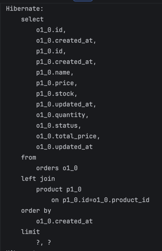
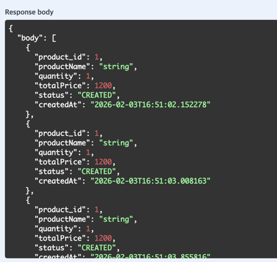
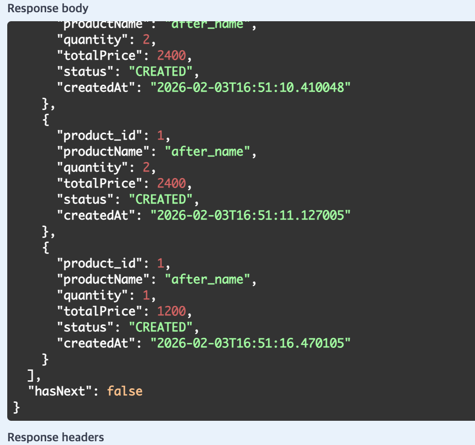
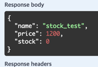
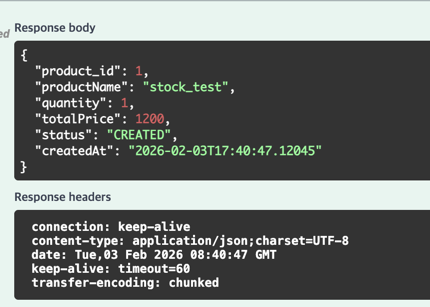
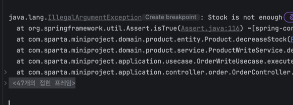

## 1.0.0
## installation

1.&nbsp;**clone repository**
```shell
git clone https://github.com/sunsik17/mini-project.git
```

2.&nbsp;**생성 된 프로젝트 디렉토리로 이동**
```shell
cd mini_project
```

3.&nbsp;**dependencies**
```shell
./gradlew build
```

4.&nbsp;**application run**
```shell
java -jar build/libs/mini_project-0.0.1-SNAPSHOT.jar
```

url : http://localhost:8080/
swagger : http://localhost:8080/swagger-ui/index.html#

## order list result

| quary | before | after |
|:------|:------:|------:|
|  |   |  |

## stock test

| stock | first | second |
|:------|:-----:|------:|
|       |  |  |

